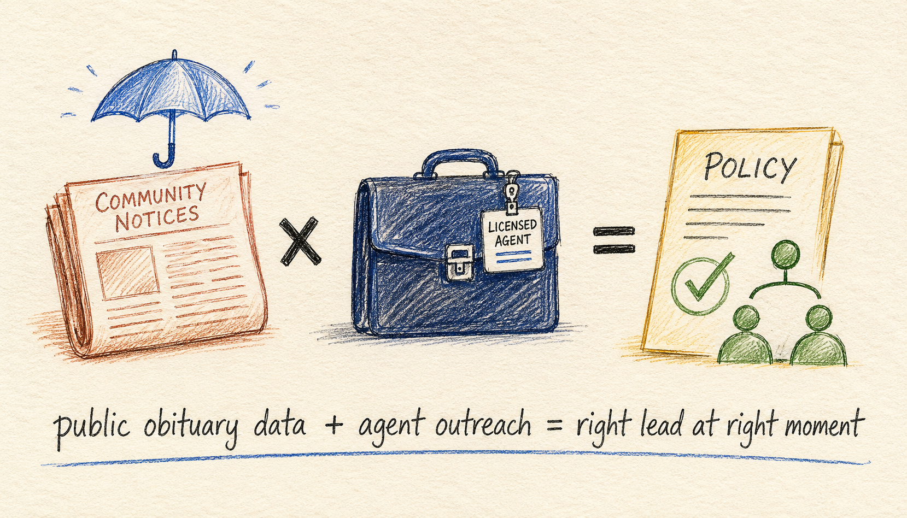

# Obituary Life-Insurance Lead Scraper



Recent US obituaries with surviving family extraction, funeral home details, estate signals, lead score, and insurance pitch angles. Built for life insurance agents, final-expense IMOs, and estate planners. Pay per result.

[](https://apify.com/george.the.developer/obituary-life-insurance-leads)
[](#pricing)

## Why this exists

LIMRA published a 2025 white paper on AI + obituary data for preneed insurance lead generation. The final-expense market is $1.05B in new annualized premium with 16% YoY growth. Final-expense exclusive leads cost $75-$200 each from traditional vendors. The data is public. The structured extraction is the missing piece.

This actor pulls recent obituaries, extracts surviving family with relationships, identifies the funeral home contact, flags estate / business / charitable signals, scores the lead 0-100, and writes pitch angles you can drop straight into a CRM template. One request per record. No seat license, no monthly minimum.

## How It Works

```
                ┌──────────────────────────────────────────────┐
                │   Obituary Life-Insurance Lead Scraper       │
                └──────────────────┬───────────────────────────┘
                                   │
                ┌──────────────────▼───────────────────────────┐
                │  Source 1: LEGACY.COM (anti-bot tier)        │
                │  Routed through VPS Go TLS service           │
                │  (Chrome 124 fingerprinted client)           │
                │  /us/obituaries/local/{state}/{city}         │
                └──────────────────┬───────────────────────────┘
                                   │
                ┌──────────────────▼───────────────────────────┐
                │  Source 2: TRIBUTES.COM (lighter anti-bot)   │
                │  Direct fetch fallback                       │
                └──────────────────┬───────────────────────────┘
                                   │
                ┌──────────────────▼───────────────────────────┐
                │  Step 3: SURVIVING FAMILY EXTRACTION         │
                │  "survived by" block detection               │
                │  Relationship + name + (location) parser     │
                │  Filters non-name fragments                  │
                └──────────────────┬───────────────────────────┘
                                   │
                ┌──────────────────▼───────────────────────────┐
                │  Step 4: SIGNAL DETECTION                    │
                │  Estate / trust / executor mentions          │
                │  Business owner / founder mentions           │
                │  Charity named (in lieu of flowers...)       │
                │  Funeral home + phone + address              │
                └──────────────────┬───────────────────────────┘
                                   │
                ┌──────────────────▼───────────────────────────┐
                │  Step 5: LEAD SCORING + PITCH ANGLES         │
                │  0-100 score weighted on family + signals    │
                │  Custom insurance pitch lines per record     │
                └──────────────────┬───────────────────────────┘
                                   │
                ┌──────────────────▼───────────────────────────┐
                │  Output: structured JSON per obituary        │
                └──────────────────────────────────────────────┘
```

## Endpoints

| Method | Path | Purpose | Charge |
|--------|------|---------|--------|
| `GET` | `/` | Service info | none |
| `GET` | `/health` | Health probe | none |
| `GET` | `/search?location=Phoenix,AZ&days=7&limit=20` | Recent obits by city + state, basic record per result | $0.50 / record |
| `GET` | `/enrich?url=https://www.legacy.com/...` | Full enrichment for one obituary URL | $2.00 / record |
| `POST` | `/enrich/bulk` | Up to 25 URLs in one call | $2.00 / record |

Each run also incurs a $0.10 actor-start fee.

## Quick start

```bash
TOKEN="<your-apify-token>"
BASE="https://george-the-developer--obituary-life-insurance-leads.apify.actor"

# Last 7 days of Phoenix obituaries
curl "$BASE/search?location=Phoenix,AZ&days=7&limit=20" \
  -H "Authorization: Bearer $TOKEN"

# Full enrichment for one obituary
curl "$BASE/enrich?url=https://www.legacy.com/us/obituaries/example" \
  -H "Authorization: Bearer $TOKEN"

# Bulk enrichment
curl -X POST "$BASE/enrich/bulk" \
  -H "Authorization: Bearer $TOKEN" \
  -H "Content-Type: application/json" \
  -d '{"urls":["https://www.legacy.com/...","https://www.tributes.com/..."]}'
```

## Sample response (enriched)

```json
{
  "ok": true,
  "via": "vps",
  "record": {
    "deceased": {
      "name": "Jane Marie Doe",
      "age": 72,
      "date_of_death": "2026-04-22",
      "location": "Phoenix, AZ",
      "photo_url": "https://..."
    },
    "obituary_text_excerpt": "Jane Marie Doe, age 72, of Phoenix, AZ, passed away peacefully...",
    "surviving_family": [
      {"name": "John A. Doe", "relationship": "husband", "location": "Phoenix, AZ"},
      {"name": "Sarah Smith", "relationship": "daughter", "location": "Tucson, AZ"},
      {"name": "Michael Doe", "relationship": "son", "location": "Mesa, AZ"}
    ],
    "funeral_home": {
      "name": "Memorial Mortuary",
      "address": "123 Main St, Phoenix, AZ 85001",
      "phone": "(602) 555-1234",
      "website": null
    },
    "service_details": {
      "viewing_date": "April 25, 2026",
      "service_date": "April 26, 2026",
      "service_url": null
    },
    "estate_signals": {
      "mentions_estate": true,
      "mentions_business_owner": true,
      "mentions_charity": true,
      "charity_named": "American Heart Association"
    },
    "lead_score": 84,
    "insurance_pitch_angles": [
      "Surviving spouse may need new term-life policy or beneficiary review on existing policies.",
      "2 adult children mentioned. Final-expense coverage for surviving parent is a common need.",
      "Estate or trust mentioned. Likely candidate for estate planning, probate counsel, or pre-need insurance review.",
      "Business ownership signaled. Family business succession + key-person life insurance is a high-value pitch.",
      "Charitable giving signal (charity: American Heart Association). Open to donor-advised fund, charitable remainder trust, or insurance-funded gifting conversations."
    ],
    "source": {
      "platform": "legacy.com",
      "url": "https://www.legacy.com/...",
      "scraped_at": "2026-05-09T18:30:00Z"
    }
  }
}
```

## Pricing

| Event | Price | What it covers |
|-------|-------|----------------|
| `apify-actor-start` | $0.10 | One run start (per GB of memory, minimum one) |
| `obituary-discovered` | $0.50 | One obituary record discovered (deceased name, date, location, source URL) |
| `obituary-enriched` | $2.00 | Full enrichment with surviving family, funeral home, estate signals, lead score, pitch angles |

A traditional final-expense exclusive lead costs $75-$200. Even at $2 per fully-enriched record this is two orders of magnitude cheaper for the agent doing their own outreach.

## Use cases

1. **Final-expense life insurance agents** running outreach to surviving spouses
2. **Estate planning attorneys** offering probate, trust, and will services to surviving families
3. **Funeral product upsell** (urn, casket, headstone vendors filtered by service date)
4. **Death cleaning / estate sale services** booking jobs from current obituary inventory
5. **Financial advisors** offering beneficiary review and AUM rollover services
6. **Pre-need insurance carriers** running campaigns based on charitable giving signals

## Data sources

- **Legacy.com** — primary, broadest US coverage. Routed through VPS Go TLS service (Chrome 124 fingerprinted client) to handle Datadome / Cloudflare protection.
- **Tributes.com** — lighter anti-bot, useful for direct-fetch records.
- **Funeral home networks** (FrontRunner, Tukios) — deferred to v1.1.

## Honest tradeoffs

- Cold-start latency on first call after idle (10-30s while Apify wakes the Standby actor)
- Legacy.com first-fetch may be slow (2-5s) due to TLS handshake through the Go service
- Surviving-family extraction misses single-token first names (e.g. "Emma, Noah, Ava" sentence). v1.1 will handle list patterns inside grandchildren clauses.
- US-only in v1. UK probate notices are a separate market (handled differently via the UK Gazette).
- Date parsing returns the raw matched string (e.g. "April 22, 2026"). v1.1 will normalize to ISO-8601.
- Funeral home extraction works best on Legacy.com pages where "Arrangements by..." is in the body. Sites that hide it inside JS-rendered footers may return null.

## Compliance and ethics

This actor surfaces only data published in public obituaries. Use responsibly:

- Respect the grieving period. Most agents wait 14-30 days before outreach.
- Always identify yourself and the source of the lead in first contact.
- Honor requests to be removed.
- US state DNC laws + LIMRA preneed best-practice guidelines apply.

## Docs and examples

Full curl, Node, and Python examples at [github.com/the-ai-entrepreneur-ai-hub/obituary-life-insurance-leads-docs](https://github.com/the-ai-entrepreneur-ai-hub/obituary-life-insurance-leads-docs).

## More from this developer

Other lead-gen actors built for the same pay-per-result model:

- **[Funded Startup Tracker](https://apify.com/george.the.developer/funded-startup-tracker)** — TechCrunch + SEC EDGAR funding events with parsed amount, round, investors, founders, hiring signals. $0.04 / $0.10 per record.
- **[ATS Hire-Trigger Intent Scraper](https://apify.com/george.the.developer/ats-hire-trigger-intent-scraper)** — Greenhouse + Lever + Ashby + SmartRecruiters jobs in one API. Hiring intent signals for SDR teams. $0.005 / $0.015 per job.
- **[Shopify DTC Brand Discovery](https://apify.com/george.the.developer/shopify-dtc-brand-discovery)** — Shopify stores by niche with tech-stack detection. $0.02 / $0.05 per store.
- **[Email Validator API](https://apify.com/george.the.developer/email-validator-api)** — SMTP probe, MX record check, disposable detection. Pairs with this actor for verifying surviving-family emails. $0.002 per email.
- **[Domain WHOIS Lookup](https://apify.com/george.the.developer/domain-whois-lookup)** — Domain registration data for funeral home / estate website intel. $0.005 per domain.

Full portfolio: [apify.com/george.the.developer](https://apify.com/george.the.developer).

## License

MIT.
